# GymAPP

Личный дневник тренировок и питания в Telegram. Пишешь боту как другу: «жим 3 по 10 на 60», «плов и пол лепёшки», «спал 6 часов, ноет плечо», можно голосом или фото. Нейросеть разбирает, ты подтверждаешь кнопкой. Мини-апп «Дневник» открывает тренировку дня по программе с готовыми весами, хранит историю, рисует прогресс силовых и веса тела, считает КБЖУ.

<p>
  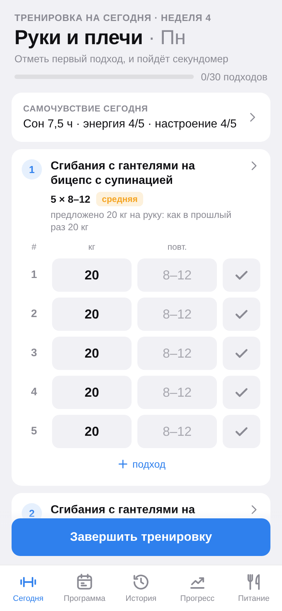
  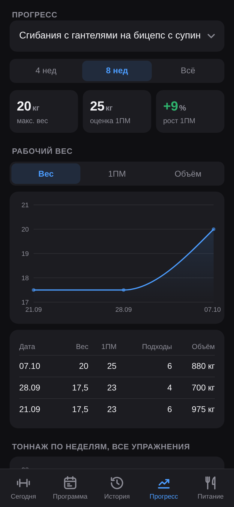
  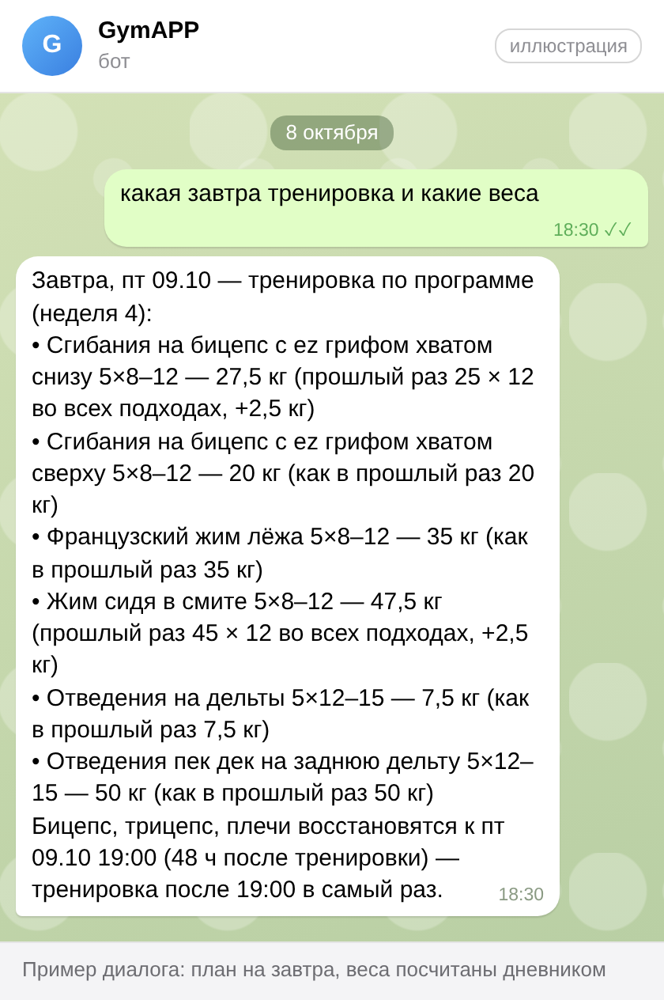
</p>

## Что умеет

### Записи из чата
- **Тренировки**: «жим лёжа 3 по 10 на 60», «сгибания 3х12 по 14, французский жим 3 по 10 на 25», «дропсет на бицепс 12-6-6 с 16 кг».
- **Еда**: «200 г гречки и 2 яйца», «три куриные самсы», «плов, касушка и пол лепёшки» → оценка КБЖУ. Если слово незнакомое, бот ищет блюдо в Open Food Facts и Википедии и предлагает варианты кнопками; если неясен размер, спросит «Уточни: …».
- **Самочувствие**: «спал 6 часов, болит левое плечо, сил мало» → сон, энергия, настроение, боли. В тренировочный день после сохранения бот пришлёт поправленный план.
- **Вес тела**: «вес 85,2» → «Записать вес?» и график в мини-аппе.
- **Голос** до 2 минут (распознавание Groq Whisper): бот покажет, что услышал; неправильное можно исправить словом.
- **Фото тарелки** → оценка по фото. Ничего не пишется в базу без «✅ Сохранить», исходный текст хранится рядом с записью.

| Еда текстом | Тренировка и рекорды |
|---|---|
| 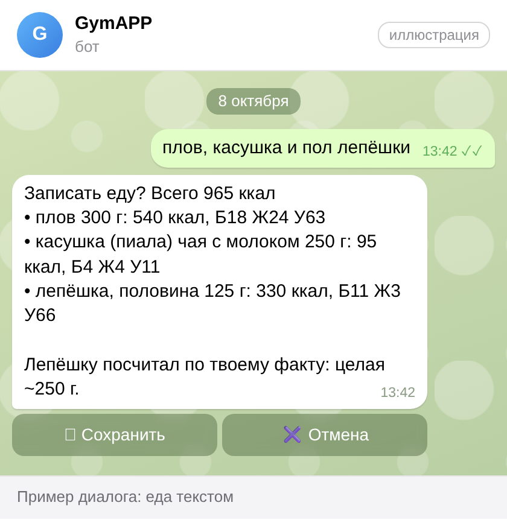 | 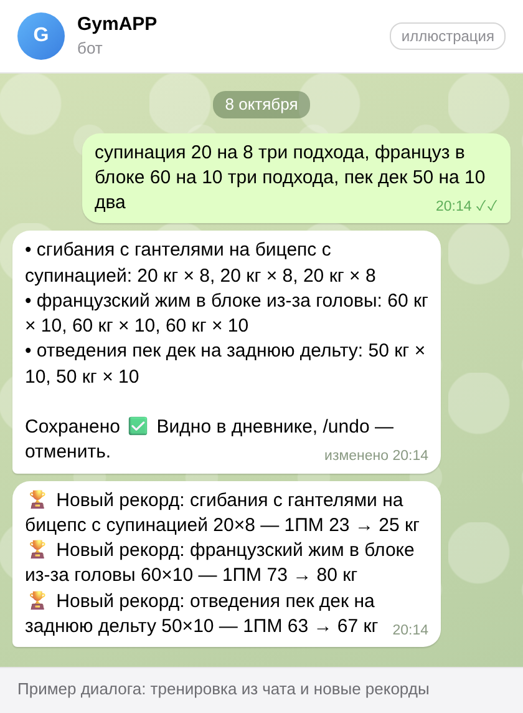 |

### Упаковка: штрихкод и этикетка
Фото штрихкода → карточка продукта из Open Food Facts, фото этикетки → значения с этикетки. Дальше «Сколько съел?» кнопками (вся упаковка, половина, порция) или словами («60 г», «2 порции»). Продукт запоминается: в следующий раз хватит «тот же батончик» или «протеин 1 скуп». Список и удаление: /products.

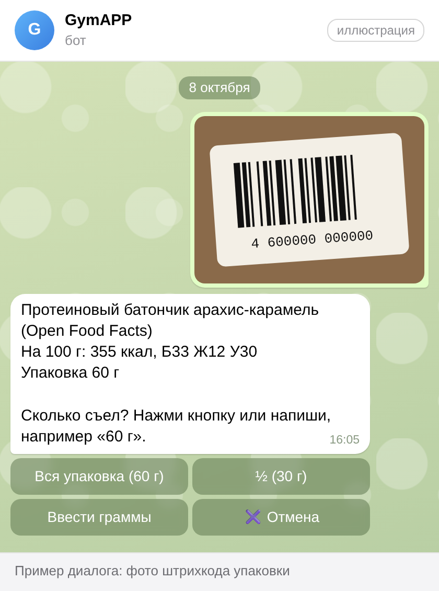

### Правки сохранённого
«удали самсу», «самса была 2, а не 3», «удали последний подход», «в жиме было 85, а не 80», «сон был 7 часов, а не 5» → бот покажет, что изменит, и правит только после кнопки. /undo удаляет последнюю запись из чата.

### Настройки из чата
«норма 2800 ккал, белок 170», «напоминай в 21:00 про КБЖУ», «поставь сегодня жим 85», «таймер отдыха 2 минуты», смена программы → предпросмотр «Применить?» с кнопкой. Без нажатия ничего не меняется.

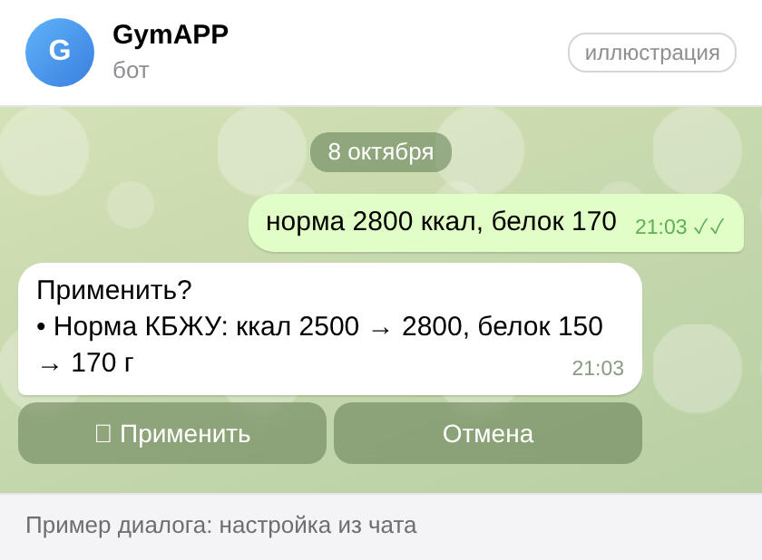

### Вопросы по дневнику
«сколько я съел белка сегодня», «какой тоннаж за неделю», «когда последний раз был присед», «какая завтра тренировка и какие веса». Числа считает код по базе (еда, тоннаж, рекорды, веса), модель только формулирует, а на частые вопросы (план и веса на день, еда за день) бот отвечает прямо из подсчётов. Ответ модели проверяется кодом: число или упражнение о прошлом, которого нет в дневнике, — ответ пересобирается, а если не вышло, бот честно отвечает тем, что посчитано.

### Рабочие веса и подсказки
Для каждого упражнения дня дневник сам считает вес: по прошлому разу и двойной прогрессии (все подходы на верх диапазона → +2,5 кг), по «запомни: рабочий в жиме 80» или по весу, заданному на сегодня из чата. У гантелей вес на одну руку, так и подписано: «20 кг на руку». Если упражнения ещё не было, вес переносится с похожего упражнения, только того же варианта и из белого списка. Если перенести не с чего, подсказка: подобрать по ощущениям. Бот и мини-апп считают одинаково.

### Рекорды и разгрузка
После сохранённой тренировки (из чата или мини-аппа) бот пишет «🏆 Новый рекорд: …» (1ПМ, вес или повторы), мини-апп показывает тост. Если прогресс встал, давно не было разгрузки или самочувствие плохое несколько дней, бот предложит разгрузочную неделю; на ней план дня легче. /deload показывает статус, начинает или отменяет разгрузку.

### Советы и план дня
- **/advice** (или «что посоветуешь?») — советы по питанию, тренировкам и восстановлению: учитывает профиль, факты, еду, самочувствие и восстановление групп мышц после последних тренировок.
- **/plan** — план на сегодня с поправками под сон, боли, питание и восстановление (лёгкий день, отдых, меньше подходов). В мини-аппе переключатель «Как в программе / С поправкой». `/plan force` пересчитывает.
- **/today** — тренировка дня по программе как есть.
- **Запомни**: «запомни: не ем творог», «запомни, что манты у нас ~90 г» → факты для разбора и советов (до 50 штук). Список и удаление: /facts.

### Напоминания
Ежедневно или в выбранный день недели: свой текст, остаток КБЖУ на сегодня, совет недели, утренний вопрос о самочувствии (ответ сохранится). Настраиваются в мини-аппе (Питание → Настройки) или словами в чате.

### Мини-апп «Дневник»
Кнопка «Дневник» слева от поля ввода. Экраны:
- **Сегодня**: тренировка дня, заполненная весами; отметка подходов, таймер отдыха, самочувствие дня.
- **Программа**: недели и дни программы.
- **История**: тренировки по неделям с подходами.
- **Прогресс**: вес, 1ПМ и объём по упражнению, тоннаж по неделям, вес тела с графиком.
- **Питание**: КБЖУ за день и неделю, профиль «О себе», факты, норма, напоминания.

Живое обновление: запись из чата появляется в открытом мини-аппе сразу (SSE). Идущая тренировка хранится на сервере и восстанавливается на другом устройстве; без сети подходы копятся и отправляются позже.

| Сегодня | История | Прогресс | Вес тела | Питание | Настройки |
|---|---|---|---|---|---|
|  | 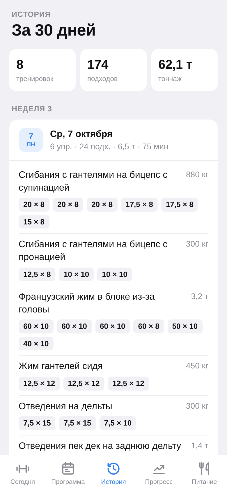 | 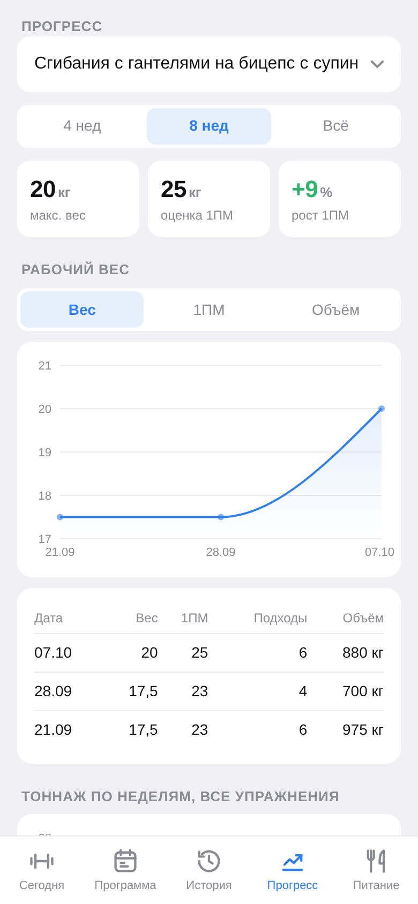 | 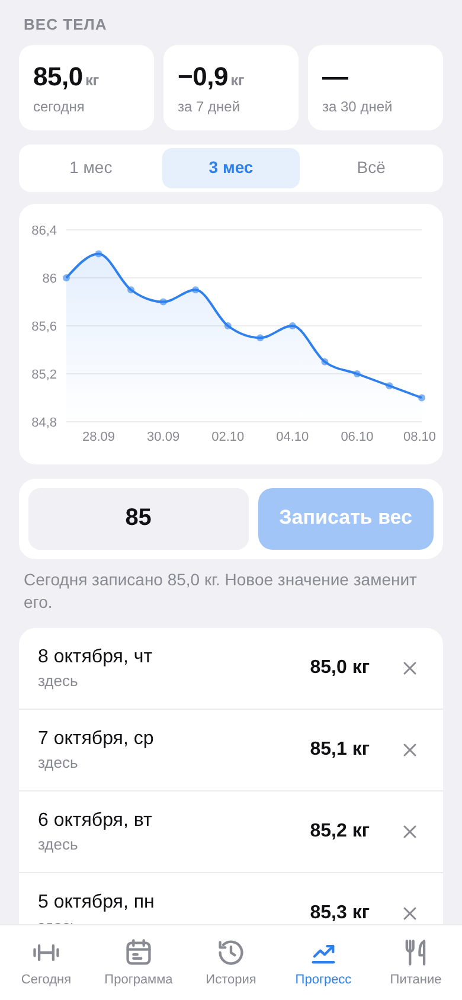 | 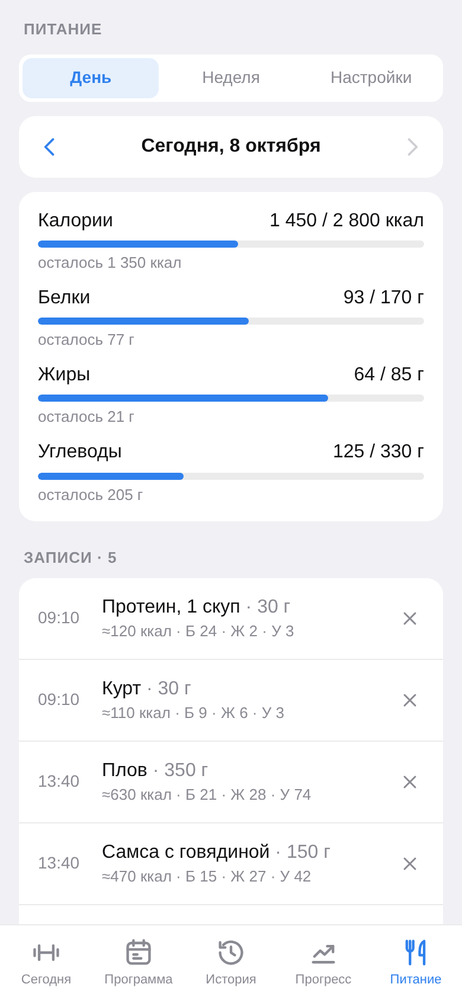 | 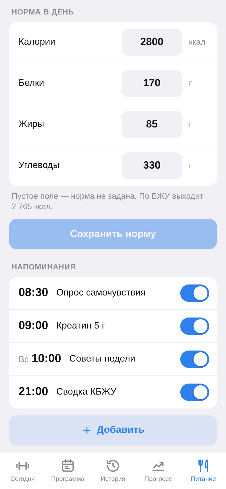 |
| 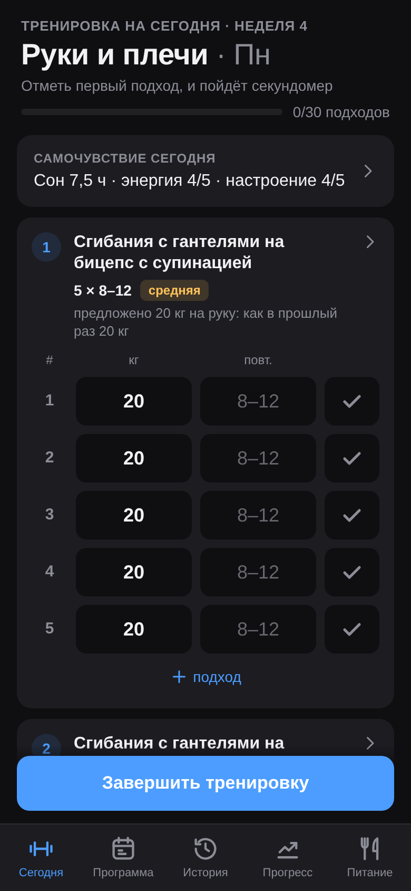 | 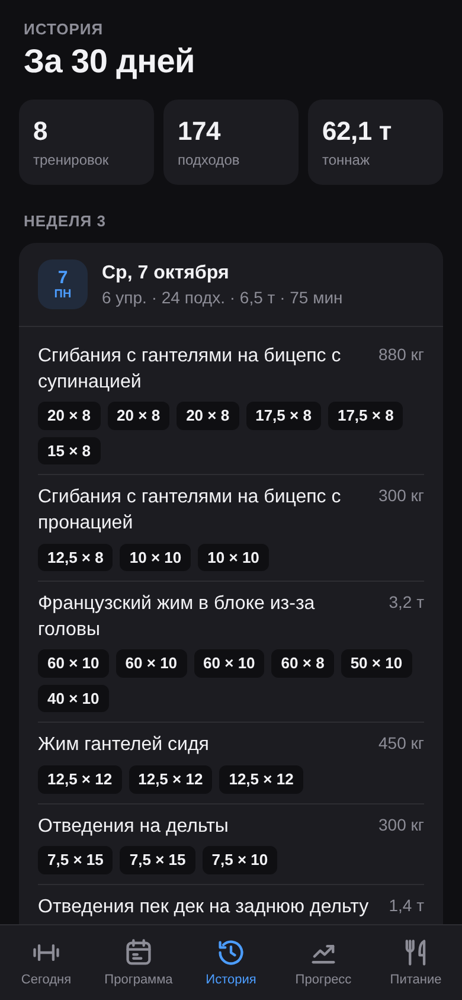 |  | 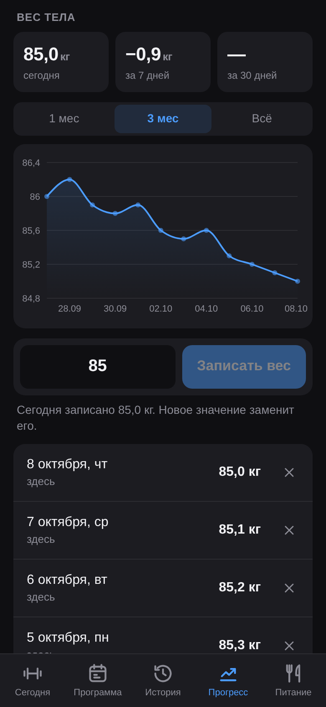 | 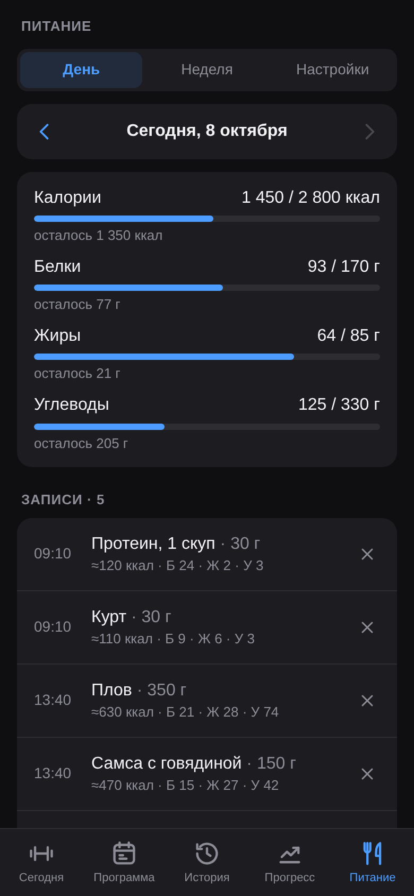 | 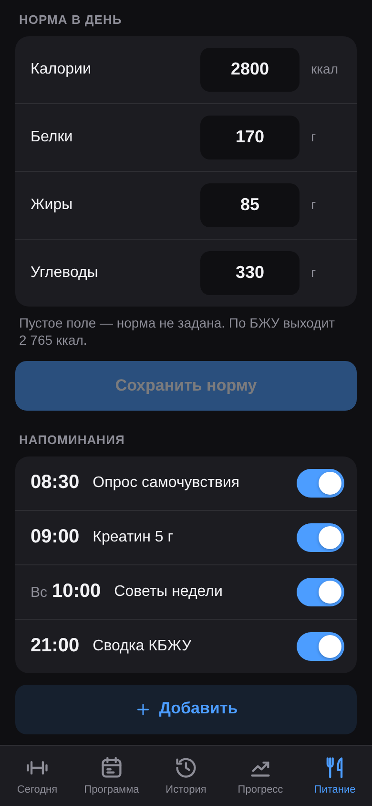 |

Программа: [светлая](docs/screens/miniapp-program-light.png), [тёмная](docs/screens/miniapp-program-dark.png). Скриншоты сняты с настоящего мини-аппа на демо-данных; картинки чата — иллюстрации (пример диалога) с текстами из кода бота. Как переснять: `docs/screens/_tools/`.

### Копии базы
Каждый день (на сервере) бот присылает владельцу копию базы `.db.gz`, последние 7 копий лежат рядом с базой в `data/backups`. /backup — копия прямо сейчас.

## Команды бота
| Команда | Что делает |
|---|---|
| /start, /help | Как записывать, кнопка «Открыть дневник» |
| /today | План на сегодня по программе |
| /plan | План с поправками под самочувствие (`/plan force` — пересчитать) |
| /undo | Удалить последнюю запись из чата |
| /deload | Разгрузочная неделя: статус, начать, отменить |
| /advice | Советы по питанию, тренировкам и восстановлению |
| /facts | Что бот помнит о тебе |
| /products | Мои продукты (штрихкод, этикетка) |
| /backup | Копия базы в чат |
| /llm | Нейросети: состояние и расход; `/llm test` — проверочный запрос |

## Нейросети
Маршруты пробуются по очереди:
1. **Claude Opus 5.5** (`ANTHROPIC_API_KEY`, модель в `ANTHROPIC_MODEL`) — основной. Расходует предоплаченные API-кредиты подписчика. Когда кредиты кончаются, API отвечает «credit balance is too low», и бот на час уходит на резерв, потом пробует Claude снова. Для ключа уровня организации (ошибка 400 «not scoped to a workspace») нужен ещё `ANTHROPIC_WORKSPACE_ID` (`wrkspc_…`). `ANTHROPIC_ENABLED=false` выключает Claude, не удаляя ключ.
2. **Groq** (`GROQ_API_KEY`, бесплатный ключ на https://console.groq.com/keys; пустой = `STT_API_KEY`) — модели из `GROQ_MODELS`, у каждой свои лимиты.
3. **OpenRouter** (`OPENROUTER_API_KEY`) — бесплатные модели `OPENROUTER_MODEL` и `OPENROUTER_FALLBACK_MODELS`, последний резерв. Если перестали отвечать, выбери текущие на https://openrouter.ai/models?max_price=0.

На 429 маршрут пропускается до сброса лимита (60 с, если провайдер не сказал). Фото еды идут только в модели с картинками (`VISION_MODELS`, `OPENROUTER_VISION_MODELS`). /llm в боте показывает состояние маршрутов, расход за день и стоимость Claude за месяц; `/llm test` делает один короткий запрос. Ключи бот не показывает.

Голос: `STT_API_KEY` (Groq Whisper, бесплатно), аудио уходит в Groq. Без ключа голос выключен.

Проверить разбор без Telegram: `uv run --project bot python -m gymbot.llm.check "три куриные самсы"` (диалог: `--dialog "текст1" "текст2"`, факты: `--fact "самса ~150 г"`).

## Запуск на своём компьютере

Нужно один раз установить:
- [uv](https://docs.astral.sh/uv/getting-started/installation/) (ставит нужный Python сам),
- Node.js 20+,
- `cloudflared` — бесплатный HTTPS-туннель, без него Telegram не откроет мини-апп:
  - Windows: `winget install Cloudflare.cloudflared`
  - macOS: `brew install cloudflared`
  - Linux / WSL: `curl -L -o cloudflared.deb https://github.com/cloudflare/cloudflared/releases/latest/download/cloudflared-linux-amd64.deb && sudo dpkg -i cloudflared.deb`

Затем:
```bash
git clone https://github.com/AmirBazanov/AMGym.git && cd AMGym
cp .env.example .env          # BOT_TOKEN и хотя бы один ключ нейросети: ANTHROPIC_API_KEY, GROQ_API_KEY (или STT_API_KEY) или OPENROUTER_API_KEY
uv run --project bot python -m gymbot.dev
```
Команда собирает мини-апп, поднимает туннель, применяет миграции БД, загружает программы из `data/programs/` и запускает бота. В Telegram открой бота, нажми /start, потом кнопку «Дневник» слева от поля ввода. Пока терминал открыт, всё работает; адрес туннеля меняется при каждом запуске, бот обновляет кнопку сам.

Все переменные с пояснениями — в `.env.example`. Основные:
- `BOT_TOKEN` — токен от @BotFather. Если бот уже работает на сервере, локально используй отдельного тестового бота: положи его токен в `.env.local` (перекрывает `.env`). Polling с боевым токеном снимет вебхук сервера.
- `ALLOWED_USER_IDS=[...]` — закрыть бота от чужих (свой id бот покажет на /start).
- `ANTHROPIC_API_KEY`, `ANTHROPIC_WORKSPACE_ID`, `GROQ_API_KEY`, `OPENROUTER_API_KEY`, `STT_API_KEY` — нейросети и голос (см. выше).
- `TAVILY_API_KEY` — необязательный веб-поиск незнакомых блюд.
- `TIMEZONE` — часовой пояс для дней, напоминаний и отображения (по умолчанию `Europe/Moscow`).
- `DATABASE_URL` — по умолчанию SQLite `data/gym.db`.
- `BACKUP_ENABLED`, `BACKUP_HOUR` — ежедневная копия базы в Telegram (по умолчанию включена только с `BOT_MODE=webhook`).
- `MCP_TOKEN` — MCP-сервер на `/mcp` для Claude Code (см. `deploy/README.md`).

Данные лежат в `data/gym.db` (SQLite).

**Только мини-апп в браузере**: в `.env` поставь `RUN_BOT=false` и `DEV_USER_ID=1`, запусти `uv run --project bot python -m gymbot.main` и открой http://localhost:8000. Не включай `DEV_USER_ID` вместе с туннелем.

## Развёртывание
На свой сервер или VPS (systemd, вебхук, постоянный домен, MCP, CI/CD): `deploy/README.md`.

## Проверки перед коммитом
```bash
cd bot && uv run ruff check src tests && uv run pytest -q
cd miniapp && npm run typecheck && npm run build && npm test
```

Устройство проекта и правила: `CLAUDE.md`. План: `ROADMAP.md`. Формат программ: `docs/program-format.md`.
