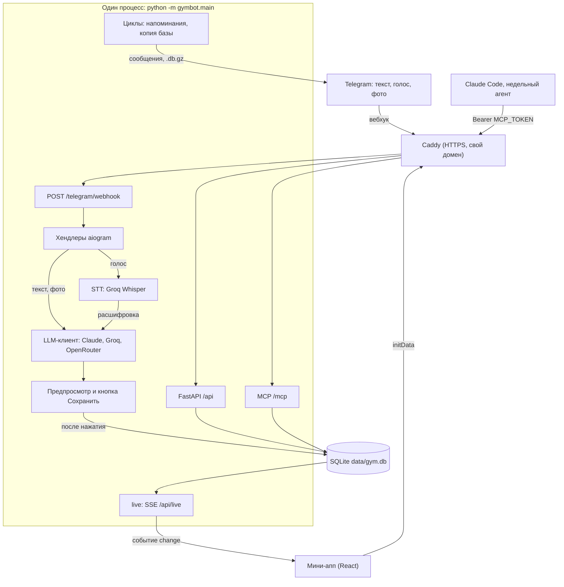

# GymAPP

Личный дневник тренировок и питания в Telegram. Пишешь боту как другу: «жим 3 по 10 на 60», «плов и пол лепёшки», «спал 6 часов, ноет плечо», можно голосом или фото. Нейросеть разбирает, ты подтверждаешь кнопкой. Мини-апп «Дневник» открывает тренировку дня по программе с готовыми весами, хранит историю, рисует прогресс силовых и веса тела, считает КБЖУ.

<p>
  
  
  
</p>

## Что умеет

### Записи из чата
- **Тренировки**: «жим лёжа 3 по 10 на 60», «сгибания 3х12 по 14, французский жим 3 по 10 на 25», «дропсет на бицепс 12-6-6 с 16 кг».
- **Еда**: «200 г гречки и 2 яйца», «три куриные самсы», «плов, касушка и пол лепёшки» → оценка КБЖУ. Если слово незнакомое, бот ищет блюдо в Open Food Facts и Википедии и предлагает варианты кнопками; если неясен размер, спросит «Уточни: …».
- **Самочувствие**: «спал 6 часов, болит левое плечо, сил мало» → сон, энергия, настроение, боли. В тренировочный день после сохранения бот пришлёт поправленный план.
- **Вес тела**: «вес 85,2» → «Записать вес?» и график в мини-аппе.
- **Голос** до 2 минут (распознавание Groq Whisper): бот покажет, что услышал; неправильное можно исправить словом.
- **Фото тарелки** → оценка по фото. Ничего не пишется в базу без «✅ Сохранить», исходный текст хранится рядом с записью.

| Еда текстом | Тренировка и рекорды |
|---|---|
|  |  |

### Упаковка: штрихкод и этикетка
Фото штрихкода → карточка продукта из Open Food Facts, фото этикетки → значения с этикетки. Дальше «Сколько съел?» кнопками (вся упаковка, половина, порция) или словами («60 г», «2 порции»). Продукт запоминается: в следующий раз хватит «тот же батончик» или «протеин 1 скуп». Список и удаление: /products.


### Правки сохранённого
«удали самсу», «самса была 2, а не 3», «удали последний подход», «в жиме было 85, а не 80», «сон был 7 часов, а не 5» → бот покажет, что изменит, и правит только после кнопки. /undo удаляет последнюю запись из чата.

### Настройки из чата
«норма 2800 ккал, белок 170», «напоминай в 21:00 про КБЖУ», «поставь сегодня жим 85», «таймер отдыха 2 минуты», смена программы → предпросмотр «Применить?» с кнопкой. Без нажатия ничего не меняется.


### Правки программы из чата
Программу можно править словами или голосом: убрать, добавить или заменить упражнение в дне, поменять подходы и повторы, порядок, поставить рабочий вес на ближайший день с этим упражнением, перенести день или поменять два дня местами внутри недели, назначить разгрузочную неделю с сегодня или со следующего понедельника. Перед записью бот покажет «Что изменю» (день, упражнение, недели) и правит только после «✅ Применить». Замена по умолчанию — на все недели, остальное — на текущую неделю; при первой правке шаблона создаётся твоя копия, оригинал остаётся. Перенос и обмен дней по умолчанию касаются только текущей недели; отметка ✓ сделанного дня переезжает вместе с ним, о чём превью предупреждает. Облегчённый день и веса в процентах пока не поддерживаются, а фразы о самочувствии («на этой неделе делоад, спал плохо») идут в дневник, а не в правку.

| Команда | Что сделает |
|---|---|
| «убери французский жим из дня рук» | Уберёт упражнение из дня на текущей неделе |
| «добавь подтягивания в день спины 3×8» | Добавит подтягивания 3×8 в конец дня спины на текущей неделе |
| «вместо жима в смите поставь жим гантелей» | Заменит жим в смите на жим гантелей во всех неделях |
| «на разгибания 4 подхода по 10–12» | Поставит 4 подхода по 10–12 повторов на текущей неделе |
| «поставь на сгибания 30 кг» | Запишет вес 30 кг на ближайший день программы со сгибаниями |
| «поменяй местами руки и базу на этой неделе» | Поменяет два дня местами на текущей неделе, в превью оба дня с датами |
| «сделай сегодня базу вместо рук» | Поменяет сегодняшний день с днём базы на текущей неделе |
| «перенеси тренировку на завтра» | Перенесёт сегодняшний день на завтра; если завтра занято — поменяет дни местами |
| «перенеси пятницу на субботу» | Перенесёт пятничную тренировку на субботу текущей недели |
| «следующая неделя — делоад» | Назначит разгрузочную неделю с понедельника: веса −15 %, подходов на треть меньше |

### Вопросы по дневнику
«сколько я съел белка сегодня», «какой тоннаж за неделю», «когда последний раз был присед», «какая завтра тренировка и какие веса». Числа считает код по базе (еда, тоннаж, рекорды, веса), модель только формулирует, а на частые вопросы (план и веса на день, еда за день) бот отвечает прямо из подсчётов. Ответ модели проверяется кодом: число или упражнение о прошлом, которого нет в дневнике, — ответ пересобирается, а если не вышло, бот честно отвечает тем, что посчитано. Модель отвечает как тренер: сначала прямой ответ, потом 2–5 пунктов и следующий шаг; на «руки не восстановились» предлагает поменять день, облегчить или отдохнуть, а не настаивает на программе. Названия упражнений и веса выделены жирным.

### Рабочие веса и подсказки
Для каждого упражнения дня дневник сам считает вес: по прошлому разу и двойной прогрессии (все подходы на верх диапазона → +2,5 кг), по «запомни: рабочий в жиме 80» или по весу, заданному на сегодня из чата. У гантелей вес на одну руку, так и подписано: «20 кг на руку». Если упражнения ещё не было, вес переносится с похожего упражнения, только того же варианта и из белого списка. Если перенести не с чего, подсказка: подобрать по ощущениям. Бот и мини-апп считают одинаково.

### Рекорды и разгрузка
После сохранённой тренировки (из чата или мини-аппа) бот пишет «🏆 Новый рекорд: …» (1ПМ, вес или повторы), мини-апп показывает тост. Если прогресс встал, давно не было разгрузки или самочувствие плохое несколько дней, бот предложит разгрузочную неделю; на ней план дня легче. /deload показывает статус, начинает или отменяет разгрузку.

### Советы и план дня
- **/advice** (или «что посоветуешь?») — советы по питанию, тренировкам и восстановлению: учитывает профиль, факты, еду, самочувствие и восстановление групп мышц после последних тренировок.
- **/plan** — план на сегодня с поправками под сон, боли, питание и восстановление (лёгкий день, отдых, меньше подходов). В мини-аппе переключатель «Как в программе / С поправкой». `/plan force` пересчитывает.
- **/today** — тренировка дня по программе как есть.
- **Запомни**: «запомни: не ем творог», «запомни, что манты у нас ~90 г» → факты для разбора и советов (до 50 штук). Список и удаление: /facts.

### Напоминания
Ежедневно или в выбранный день недели: свой текст, остаток КБЖУ на сегодня, совет недели, утренний вопрос о самочувствии (ответ сохранится). Настраиваются в мини-аппе (Питание → Настройки) или словами в чате.

### Мини-апп «Дневник»
Кнопка «Дневник» слева от поля ввода. Экраны:
- **Сегодня**: тренировка дня, заполненная весами; отметка подходов, таймер отдыха, самочувствие дня.
- **Программа**: недели и дни программы.
- **История**: тренировки по неделям с подходами.
- **Прогресс**: вес, 1ПМ и объём по упражнению, тоннаж по неделям, вес тела с графиком.
- **Питание**: КБЖУ за день и неделю, профиль «О себе», факты, норма, напоминания.

Живое обновление: запись из чата появляется в открытом мини-аппе сразу (SSE). Идущая тренировка хранится на сервере и восстанавливается на другом устройстве; без сети подходы копятся и отправляются позже.

| Сегодня | История | Прогресс | Вес тела | Питание | Настройки |
|---|---|---|---|---|---|
|  |  |  |  |  |  |
|  |  |  |  |  |  |

Программа: [светлая](docs/screens/miniapp-program-light.png), [тёмная](docs/screens/miniapp-program-dark.png). Скриншоты сняты с настоящего мини-аппа на демо-данных; картинки чата — иллюстрации (пример диалога) с текстами из кода бота. Как переснять: `docs/screens/_tools/`.

### Копии базы
Каждый день (на сервере) бот присылает владельцу копию базы `.db.gz`, последние 7 копий лежат рядом с базой в `data/backups`. /backup — копия прямо сейчас.

## Команды бота
| Команда | Что делает |
|---|---|
| /start, /help | Как записывать, кнопка «Открыть дневник» |
| /today | План на сегодня по программе |
| /plan | План с поправками под самочувствие (`/plan force` — пересчитать) |
| /undo | Удалить последнюю запись из чата |
| /deload | Разгрузочная неделя: статус, начать, отменить |
| /advice | Советы по питанию, тренировкам и восстановлению |
| /facts | Что бот помнит о тебе |
| /products | Мои продукты (штрихкод, этикетка) |
| /backup | Копия базы в чат |
| /llm | Нейросети: состояние и расход; `/llm test` — проверочный запрос |

## Нейросети
Маршруты пробуются по очереди:
1. **Claude Opus 5.5** (`ANTHROPIC_API_KEY`, модель в `ANTHROPIC_MODEL`) — основной. Расходует предоплаченные API-кредиты подписчика. Когда кредиты кончаются, API отвечает «credit balance is too low», и бот на час уходит на резерв, потом пробует Claude снова. Для ключа уровня организации (ошибка 400 «not scoped to a workspace») нужен ещё `ANTHROPIC_WORKSPACE_ID` (`wrkspc_…`). `ANTHROPIC_ENABLED=false` выключает Claude, не удаляя ключ.
2. **Groq** (`GROQ_API_KEY`, бесплатный ключ на https://console.groq.com/keys; пустой = `STT_API_KEY`) — модели из `GROQ_MODELS`, у каждой свои лимиты.
3. **OpenRouter** (`OPENROUTER_API_KEY`) — бесплатные модели `OPENROUTER_MODEL` и `OPENROUTER_FALLBACK_MODELS`, последний резерв. Если перестали отвечать, выбери текущие на https://openrouter.ai/models?max_price=0.

На 429 маршрут пропускается до сброса лимита (60 с, если провайдер не сказал). Фото еды идут только в модели с картинками (`VISION_MODELS`, `OPENROUTER_VISION_MODELS`). /llm в боте показывает состояние маршрутов, расход за день и стоимость Claude за месяц; `/llm test` делает один короткий запрос. Ключи бот не показывает.

Голос: `STT_API_KEY` (Groq Whisper, бесплатно), аудио уходит в Groq. Без ключа голос выключен.

Проверить разбор без Telegram: `uv run --project bot python -m gymbot.llm.check "три куриные самсы"` (диалог: `--dialog "текст1" "текст2"`, факты: `--fact "самса ~150 г"`).

## Запуск на своём компьютере

Нужно один раз установить:
- [uv](https://docs.astral.sh/uv/getting-started/installation/) (ставит нужный Python сам),
- Node.js 20+,
- `cloudflared` — бесплатный HTTPS-туннель, без него Telegram не откроет мини-апп:
  - Windows: `winget install Cloudflare.cloudflared`
  - macOS: `brew install cloudflared`
  - Linux / WSL: `curl -L -o cloudflared.deb https://github.com/cloudflare/cloudflared/releases/latest/download/cloudflared-linux-amd64.deb && sudo dpkg -i cloudflared.deb`

Затем:
```bash
git clone https://github.com/AmirBazanov/AMGym.git && cd AMGym
cp .env.example .env          # BOT_TOKEN и хотя бы один ключ нейросети: ANTHROPIC_API_KEY, GROQ_API_KEY (или STT_API_KEY) или OPENROUTER_API_KEY
uv run --project bot python -m gymbot.dev
```
Команда собирает мини-апп, поднимает туннель, применяет миграции БД, загружает программы из `data/programs/` и запускает бота. В Telegram открой бота, нажми /start, потом кнопку «Дневник» слева от поля ввода. Пока терминал открыт, всё работает; адрес туннеля меняется при каждом запуске, бот обновляет кнопку сам.

Все переменные с пояснениями — в `.env.example`. Основные:
- `BOT_TOKEN` — токен от @BotFather. Если бот уже работает на сервере, локально используй отдельного тестового бота: положи его токен в `.env.local` (перекрывает `.env`). Polling с боевым токеном снимет вебхук сервера.
- `ALLOWED_USER_IDS=[...]` — закрыть бота от чужих (свой id бот покажет на /start).
- `ANTHROPIC_API_KEY`, `ANTHROPIC_WORKSPACE_ID`, `GROQ_API_KEY`, `OPENROUTER_API_KEY`, `STT_API_KEY` — нейросети и голос (см. выше).
- `TAVILY_API_KEY` — необязательный веб-поиск незнакомых блюд.
- `TIMEZONE` — часовой пояс для дней, напоминаний и отображения (по умолчанию `Europe/Moscow`).
- `DATABASE_URL` — по умолчанию SQLite `data/gym.db`.
- `BACKUP_ENABLED`, `BACKUP_HOUR` — ежедневная копия базы в Telegram (по умолчанию включена только с `BOT_MODE=webhook`).
- `MCP_TOKEN` — MCP-сервер на `/mcp` для Claude Code (см. `deploy/README.md`).

Данные лежат в `data/gym.db` (SQLite).

**Только мини-апп в браузере**: в `.env` поставь `RUN_BOT=false` и `DEV_USER_ID=1`, запусти `uv run --project bot python -m gymbot.main` и открой http://localhost:8000. Не включай `DEV_USER_ID` вместе с туннелем.

## Развёртывание
На свой сервер или VPS (systemd, вебхук, постоянный домен, MCP, CI/CD): `deploy/README.md`.

## Проверки перед коммитом
```bash
cd bot && uv run ruff check src tests && uv run pytest -q
cd miniapp && npm run typecheck && npm run build && npm test
```

Устройство проекта и правила: `CLAUDE.md`. План: `ROADMAP.md`. Формат программ: `docs/program-format.md`.

## Как устроено

### 1. Архитектура



`bot/src/gymbot/main.py` в одном процессе применяет миграции, синхронизирует программы из `data/programs/`, затем запускает:
- **бота** (aiogram 3): long polling или, при `BOT_MODE=webhook`, приём апдейтов на `/telegram/webhook`; с `RUN_BOT=false` бота нет;
- **HTTP-сервер** (uvicorn + FastAPI, по умолчанию `127.0.0.1:8000`): API мини-аппа, собранный мини-апп из `miniapp/dist`, MCP на `/mcp` (только если задан `MCP_TOKEN`);
- **фоновые циклы** (только вместе с ботом): напоминания и ежедневная копия базы (`BACKUP_ENABLED`, по умолчанию включена при `BOT_MODE=webhook`).

HTTPS даёт внешний обратный прокси или туннель, сам процесс его не запускает (см. раздел 10).

### 2. Стек

Версии — ограничения из `bot/pyproject.toml` и `miniapp/package.json`.

| Компонент | Версия | Назначение |
|---|---|---|
| Python | `>=3.12` | бот, API, MCP |
| aiogram | `>=3.13` | Telegram-бот |
| FastAPI / uvicorn | `>=0.115` / `>=0.30` | HTTP API и раздача мини-аппа |
| SQLAlchemy (asyncio) / aiosqlite | `>=2.0` / `>=0.20` | ORM и драйвер SQLite |
| Alembic | `>=1.13` | миграции |
| pydantic / pydantic-settings | `>=2.7` / `>=2.3` | схемы и настройки из `.env` |
| anthropic | `>=1.12.1` | Claude (официальный SDK) |
| httpx | `>=0.27` | Groq, OpenRouter, STT, поиск блюд |
| mcp | `>=2.3,<3` | MCP-сервер |
| zxing-cpp / pillow | `>=3.1` / `>=11` | штрихкоды и обработка фото |
| openpyxl | `>=3.1` | импорт программ из xlsx |
| React / react-dom | `^19.0.0` | мини-апп |
| @telegram-apps/sdk-react | `^3.0.0` | Telegram Mini App SDK |
| recharts | `^3.10.1` | графики |
| Vite / TypeScript / vitest | `^7.0.0` / `^5.6.0` / `^5.0.3` | сборка, типы, тесты |

Node.js: локально 20+, в CI и на сервере — 22. Python и зависимости ставит `uv`.

### 3. Путь сообщения в боте

Текст обрабатывает `process_text` в `handlers/log_text.py` (голос приходит туда же расшифровкой). По порядку:

1. **«запомни: …»** — ловится регуляркой до модели, предлагается факт с кнопкой.
2. **Упаковка** — `handlers/products.py`: количество для открытой карточки продукта («60 г») или короткое сообщение о сохранённом продукте («тот же батончик»).
3. **Правка программы** — `handlers/chat_edit.py` («убери французский жим из дня рук», «поставь на сгибания 30 кг»), если нет открытого предпросмотра. Если модель не нашла в тексте ни одного допустимого действия, текст идёт дальше.
4. **Правки сохранённого** — `handlers/saved_edits.py` («удали самсу», «самса была 2, а не 3»), если нет открытого предпросмотра.
5. **Вес тела** — сообщение только с весом («вес 84.6») получает свой предпросмотр без модели, если нет открытого предпросмотра.
6. **Настройки** — `stage_settings` готовит предпросмотр «Применить?»; текст всё равно идёт в разбор, чтобы запись в нём не потерялась.
7. **Разбор** — `llm.parse_message` с каталогом упражнений, активными фактами и историей диалога; ответ — `ParseResult` (pydantic).
8. **Правдоподобие еды** — `services/plausibility.review`: при подозрительной оценке один раунд пересчёта, потом справочное значение или пометка «Проверь калории». Сохранение не блокируется.
9. **Ответ** — `_reply_parsed`: вопрос о дневнике уходит в `services/answer.py` (раздел 5); для незнакомых слов — варианты кнопками (`services/food_lookup.py`); для записи — предпросмотр с токеном в памяти (`PENDING`) и кнопками «Сохранить / Отмена».
10. **Сохранение** — только по кнопке: запись в БД с исходным текстом в `raw_text`, `live.publish(...)` для открытого мини-аппа; после тренировки `workout_events.after_save` пишет о рекордах и может предложить разгрузку.

**Контекст диалога** хранится в памяти процесса (`CONTEXT`, 15 минут, после перезапуска пропадает). Модели уходит не больше 3 сообщений цепочки (`MAX_CHAIN`), в `raw_text` сохраняется вся цепочка. Уточнение заменяет прежний предпросмотр (старая кнопка перестаёт работать), новая запись оставляет прежний предпросмотр рабочим. У голосовых сообщений в `raw_text` метка `[voice]`, модель её не видит.

### 4. Нейросети и маршруты

Один клиент на процесс (`gymbot.llm.openrouter.OpenRouterClient`, общий у бота, API и MCP). Маршруты по порядку (`routes_from`):
1. **Claude** (`ANTHROPIC_API_KEY`, модель `ANTHROPIC_MODEL`, по умолчанию `claude-opus-5-5`; `ANTHROPIC_ENABLED=false` выключает) — через SDK с `max_retries=0`.
2. **Groq** — модели `GROQ_MODELS`; ключ `GROQ_API_KEY`, а если он пуст — `STT_API_KEY`, когда STT настроен на Groq.
3. **OpenRouter** — `OPENROUTER_MODEL`, затем `OPENROUTER_FALLBACK_MODELS`.

Фото еды идут по своим маршрутам (`vision_routes_from`): Claude, затем `VISION_MODELS` на Groq, затем `OPENROUTER_VISION_MODELS`.

**Ошибки** (константы в `llm/openrouter.py` и `llm/claude.py`):
- 429 — маршрут пропускается до сброса лимита: `retry-after`, `x-ratelimit-reset-*` или «try again in …»; без них `RATE_LIMIT_COOLDOWN` = 60 с. Пауза ограничена `MIN_COOLDOWN` = 1 с и `MAX_COOLDOWN` = 24 ч.
- 400/401/402/403/404/413 и таймаут — сразу следующий маршрут.
- Claude: «credit balance is too low» — пропуск на `CREDIT_COOLDOWN` = 1 ч; 529 без `retry-after` — `OVERLOAD_COOLDOWN` = 30 с; 401/403 — до перезапуска; отказ модели или обрыв по `max_tokens` — следующий маршрут.
- Если упали все маршруты, а ближайший из ограниченных по 429 освобождается в пределах `MAX_WAIT` = 3 с, он пробуется ещё раз после ожидания.

**Claude по типам вызовов** (`PURPOSES` в `llm/claude.py`; effort, `max_tokens`, таймаут):

| Вызов | Effort | max_tokens | Таймаут |
|---|---|---|---|
| parse, settings, edit, baselines, lookup, json | low | 4096 | 30 с |
| photo | low | 4096 | 40 с |
| plan | low | 4096 | 25 с |
| answer | high | 12000 | 75 с |
| advice | medium | 8192 | 60 с |
| probe (`/llm test`) | low | 1024 | 30 с |

Фото на Groq/OpenRouter ждут `VISION_TIMEOUT` = 20 с, прочие запросы к ним — 60 с (таймаут httpx-клиента).

**JSON-ответы**: Claude получает схему в `output_config.format`; при 400 про схему этот тип вызова дальше идёт без неё. Groq/OpenRouter получают `response_format: json_object` (если провайдер отвечает 400, маршрут запоминается и спрашивается без него); из ответа берётся первый блок `{…}` и проверяется pydantic. Во всех случаях результат проверяет код.

**Кеширование промпта у Claude**: `cache_control` на стабильной части системного промпта, на последнем системном блоке и на последнем стабильном ходе (few-shot примеры парсера); TTL 5 минут, не больше 4 точек. Префикс короче 512 токенов не кешируется.

**Промпт парсера** `SYSTEM_PROMPT` в `llm/prompts.py` держится короче 3000 символов (проверяет `tests/test_llm_parse.py`).

**Голос** (`stt.py`): OpenAI-совместимый `/audio/transcriptions`, по умолчанию Groq `whisper-large-v3-turbo`, ключ `STT_API_KEY`, таймаут 30 с, сообщения длиннее `STT_MAX_SECONDS` (120 с) не распознаются.

**Проверка разбора без Telegram** (`llm/check.py`):
```bash
uv run --project bot python -m gymbot.llm.check "три куриные самсы"
uv run --project bot python -m gymbot.llm.check --dialog "три куриные самсы" "три штуки"
uv run --project bot python -m gymbot.llm.check --fact "самса ~150 г" "самса"
```

### 5. Точность и защита от выдумок

Ответ на вопрос о дневнике (`services/answer.py`) строится в три слоя:
1. **Код без модели.** `services/answer_intent.py` узнаёт фактические вопросы (тренировка и тоннаж за день, еда и остаток КБЖУ, последний раз и рекорд в упражнении, день программы и его веса), `services/answer_direct.py` отвечает по базе.
2. **Модель со сводкой.** Остальное отвечает модель по сводке, посчитанной кодом (профиль, факты, еда, тренировки, самочувствие, программа, план дня, веса из `services/next_weights.py`).
3. **Проверка кодом.** `services/answer_check.py` ищет в ответе утверждения о прошлом: числа с единицами (кг, ккал, подходы, N×M, тоннаж) и названия упражнений должны быть в сводке, вопросе или словах пользователя. При нарушении — одна перегенерация с поправкой, затем честный ответ тем, что посчитано. Голые числа и даты не проверяются.

**Форматирование ответов.** Модель пишет подмножество Markdown (`**жирный**`, списки). `clean_text` убирает только рассуждения и code fences. Проверка кодом и память диалога работают с простым текстом (`services/tg_format.plain`). В Telegram уходит HTML (`services/tg_html.to_html`: `<b>`, «• », экранирование `< > &`), собранный из текста модели после проверки. Если Telegram не разобрал разметку («can't parse entities»), `send_html` отправляет простой текст. Ответы из базы идут как есть, только первая строка многострочного ответа жирная. В советах жирные заголовки блоков. Тот же хелпер использует MCP-инструмент `send_message`.

**Еда.** Незнакомые слова модель не оценивает, а перечисляет в `unknown_terms`; бот ищет их в Open Food Facts и Википедии (с `TAVILY_API_KEY` — ещё в Tavily) и предлагает до 3 вариантов кнопками. Подозрительные оценки калорий ловит `services/plausibility.py` (раздел 3, шаг 8). Числа с этикетки и из Open Food Facts этой проверкой не правятся.

**Голос и фото.** Модель видит чистую расшифровку голоса. Фото уходит только провайдеру vision-маршрута: не сохраняется и не логируется (`handlers/photo.py`).

### 6. Данные и БД

20 таблиц в `bot/src/gymbot/db/models.py`:

| Класс | Таблица | Что хранит |
|---|---|---|
| `User` | `users` | Telegram id, имя, норма КБЖУ, таймер отдыха, профиль (вес, рост, год рождения, цель, «о себе») |
| `Exercise` | `exercises` | каталог упражнений: название, группа мышц, синонимы |
| `Program` | `programs` | программа: шаблон из `data/programs` или копия пользователя (`owner_user_id`, `based_on_id`), `version` для правок |
| `ProgramWeek` | `program_weeks` | неделя программы |
| `ProgramDay` | `program_days` | день недели программы, подпись дня |
| `ProgramItem` | `program_items` | упражнение дня: подходы, диапазон повторов, интенсивность, дропсет |
| `UserProgram` | `user_programs` | какая программа идёт и с какого понедельника |
| `Workout` | `workouts` | тренировка за местный день; `targets_json` — снимок предписаний дня на момент сохранения |
| `WorkoutSet` | `workout_sets` | подход: вес, повторы, номер дропа, `raw_text` |
| `FoodEntry` | `food_entries` | одна позиция еды: описание, граммы, КБЖУ, оценка или точные данные, `raw_text` |
| `WellbeingEntry` | `wellbeing_entries` | сон, качество сна, энергия, настроение, боли, заметка |
| `UserFact` | `user_facts` | факты о пользователе («запомни»), категория, активен ли |
| `ExerciseBaseline` | `exercise_baselines` | рабочие веса, извлечённые из фактов |
| `WeightOverride` | `weight_overrides` | вес упражнения на конкретный день, заданный из чата |
| `ActiveWorkout` | `active_workouts` | снимок идущей тренировки из мини-аппа |
| `DayPlan` | `day_plans` | план на день с поправками (готовность, упражнения, хеш входных данных) |
| `DeloadState` | `deload_states` | разгрузочная неделя и когда снова предлагать |
| `BodyWeight` | `body_weights` | вес тела, одно значение на местный день |
| `Product` | `products` | упакованные продукты: штрихкод, КБЖУ на 100 г, вес упаковки и порции |
| `Reminder` | `reminders` | напоминание: минута дня, вид, текст, день недели (0 = пн … 6 = вс, пусто = каждый день) |

**Миграции**: 14 файлов в `bot/migrations/versions/` (`0001_initial_schema` … `0014_program_editor`), применяются при старте.

**Переносимость**: типы без SQLite-специфики (`Numeric` для весов и КБЖУ, `JSON`, `DateTime(timezone=True)`), чтобы перейти на Postgres без переписывания моделей.

**Время**: моменты хранятся в UTC, дни (`performed_on`, `day`, `plan_date`) — местные даты в `TIMEZONE` (по умолчанию `Europe/Moscow`).

### 7. API (FastAPI)

Все `/api/*`, кроме `/api/health`, `/api/live`, `/api/docs` и `/api/openapi.json`, требуют заголовок `X-Telegram-Init-Data`.

| Метод | Путь | Назначение |
|---|---|---|
| GET | `/api/health` | проверка базы (`select 1`, таймаут 2 с), без авторизации |
| GET | `/api/state` | программа, история, норма, профиль, рабочие веса, идущая тренировка |
| PUT | `/api/settings` | программа и дата старта, таймер отдыха, норма, профиль |
| GET | `/api/programs` | список программ (шаблоны и свои копии) |
| GET | `/api/programs/{slug}` | программа целиком |
| GET | `/api/exercises` | упражнения для выбора |
| POST | `/api/workouts` | сохранить тренировку из мини-аппа (повтор с тем же id не дублирует) |
| PUT | `/api/workouts/active` | снимок идущей тренировки |
| DELETE | `/api/workouts/active` | убрать снимок |
| DELETE | `/api/workouts/{workout_id}` | удалить тренировку |
| GET | `/api/nutrition/day` | КБЖУ за день (`?date=`) |
| GET | `/api/nutrition/week` | КБЖУ за неделю (`?end=`) |
| DELETE | `/api/food/{food_id}` | удалить запись еды |
| GET | `/api/wellbeing` | самочувствие за `?days=` (по умолчанию 14) |
| DELETE | `/api/wellbeing/{entry_id}` | удалить запись самочувствия |
| GET, POST | `/api/body-weight` | ряд веса тела; записать вес за день |
| DELETE | `/api/body-weight/{day}` | удалить вес за дату |
| GET, POST | `/api/facts` | факты; добавить |
| PATCH, DELETE | `/api/facts/{fact_id}` | изменить, удалить |
| GET | `/api/plan/today` | план на сегодня |
| POST | `/api/plan/today/regenerate` | пересчитать план |
| GET, POST | `/api/reminders` | напоминания; добавить |
| PATCH, DELETE | `/api/reminders/{reminder_id}` | изменить, удалить |
| POST | `/api/live/token` | короткий токен для потока (60 с) |
| GET | `/api/live?token=…` | поток Server-Sent Events |
| POST | `/telegram/webhook` | апдейты Telegram (только `BOT_MODE=webhook`) |
| POST | `/mcp` | MCP (только при `MCP_TOKEN`) |
| GET | `/api/docs`, `/api/openapi.json` | OpenAPI |
| GET | `/` | собранный мини-апп из `miniapp/dist`, если он есть |

**Авторизация**
- **Мини-апп**: initData проверяется по HMAC-SHA-256 с ключом из `BOT_TOKEN` (`api/auth.py`), срок годности 7 дней; чужой Telegram id получает 403.
- **Разработка без Telegram**: если initData нет, задан `DEV_USER_ID`, запрос пришёл с `127.0.0.1`/`::1` (или от тестового клиента FastAPI) и в нём нет заголовка `cf-connecting-ip`, запрос выполняется от имени `DEV_USER_ID`. Процесс не стартует, если заданы одновременно `DEV_USER_ID` и `MINIAPP_URL` (он же берётся из `PUBLIC_URL`).
- **Вебхук**: заголовок `X-Telegram-Bot-Api-Secret-Token` сравнивается с `WEBHOOK_SECRET` (если пусто — случайный при каждом старте), иначе 403. Ответ 200 уходит сразу, апдейт обрабатывается в фоне.
- **MCP**: `Authorization: Bearer <MCP_TOKEN>`, иначе 401.

**Живое обновление (SSE)**
- Мини-апп получает токен `POST /api/live/token` (с initData), затем открывает `EventSource` на `GET /api/live?token=…`: EventSource не умеет слать заголовки.
- Токен подписан HMAC ключом, выведенным из `BOT_TOKEN`, живёт `TOKEN_TTL` = 60 с и нужен только для открытия потока. В логе доступа значение `token=` скрывается.
- Поток: `hello`, затем `change` с `{"topics": [...]}`, комментарий-пинг каждые 20 с; публикации в течение 0,3 с склеиваются в одно событие. У пользователя не больше 3 потоков, четвёртый закрывает самый старый.
- Темы (`services/live.py`): `state`, `nutrition`, `reminders`, `facts`, `wellbeing`, `plan`, `workouts`, `weight`, `records`, `program`. С `records` приходят сами рекорды для тоста.
- Поток привязан к id пользователя из токена: каждый получает события только о своих данных.

### 8. MCP (Model Context Protocol)

`bot/src/gymbot/mcp_server.py`, один путь `/mcp`: Streamable HTTP без сессий, ответы JSON, статический Bearer-токен `MCP_TOKEN`. Без `MCP_TOKEN` маршрут не подключается. Принимается только `Host` из `PUBLIC_URL` и локальные адреса. Все инструменты действуют от имени владельца.

18 инструментов:
- **Чтение**: `nutrition_summary`, `training_summary`, `wellbeing_summary`, `program_status`, `profile_and_facts`, `query` (один SELECT на отдельном read-only подключении, до 1000 строк, таймаут 5 с), `schema`, `service_status`.
- **Запись**: `set_targets`, `set_weight_override`, `add_fact`, `set_reminder`, `log_body_weight`, `log_note`.
- **Удаление**: `deactivate_fact`, `delete_reminder`.
- **Внешние действия**: `regenerate_plan` (вызывает модель), `send_message` (сообщение владельцу в Telegram).

Подключение: `claude mcp add --transport http amgym https://gym.algex.ru/mcp --header "Authorization: Bearer <токен>"`. Подробности, включая Claude.ai: `deploy/README.md`.

`deploy/weekly-review-prompt.md` — промпт облачного агента Claude Code, который раз в неделю читает дневник через `/mcp` и присылает разбор в Telegram.

### 9. Тесты и CI

- **Бот**: 2875 тестов pytest в 48 файлах `bot/tests/test_*.py`.
- **Мини-апп**: 495 тестов vitest в 13 файлах `miniapp/src/*.test.ts`.

```bash
cd bot && uv run ruff check src tests && uv run pytest -q
cd miniapp && npm run typecheck && npm run build && npm test
```

**`.github/workflows/ci-deploy.yml`**
- `checks` — на каждый pull request и push в `main`: ruff и pytest (uv), затем на Node 22 `npm ci`, typecheck, build, vitest.
- `deploy` — после `checks`, только при push в `main`: по SSH запускает `bash ~/amgym/deploy/setup-ec2.sh main` и показывает статус сервиса. Без секретов `EC2_HOST` / `EC2_SSH_KEY` шаг пропускается.

**`.github/workflows/uptime.yml`** — каждые 10 минут:
- `GET /api/health`, 3 попытки с паузой 20 с;
- `getWebhookInfo`: вебхук не установлен, ошибка за последние 15 минут или больше 20 апдейтов в очереди.

Оповещение в Telegram приходит при поломке, повторяется раз в 6 часов, пока не починится, и один раз при восстановлении.

### 10. Деплой и эксплуатация

Боевой сервер: AWS EC2 (Amazon Linux 2023), `https://gym.algex.ru`, `BOT_MODE=webhook`, HTTPS через Caddy (`EDGE=caddy`). Пошагово: `deploy/README.md`.

**`deploy/setup-ec2.sh [ветка]`** (Ubuntu 22.04/24.04 или Amazon Linux 2023, повторный запуск = обновление):
1. Системные пакеты, swap 1 ГБ, Node 22, uv.
2. Checkout ветки в `~/amgym`, `uv sync`, `npm ci` и сборка мини-аппа.
3. `.env` из `.env.example`, если его нет (права 600).
4. HTTPS по `.env`:
   - `PUBLIC_URL` и `EDGE=caddy` — ставит Caddy, пишет `/etc/caddy/Caddyfile` из `deploy/Caddyfile` (Let's Encrypt, порты 80/443);
   - `PUBLIC_URL` и `EDGE=tunnel` (по умолчанию) — именованный туннель Cloudflare, настроенный в панели Cloudflare; скрипт ничего не ставит. В `deploy/README.md` этот вариант назван рекомендуемым;
   - без `PUBLIC_URL` — сервис запускает `gymbot.dev` с быстрым туннелем Cloudflare (скрипт ставит `cloudflared`), адрес меняется при каждом старте.
5. systemd-сервис `gymbot` из `deploy/gymbot.service` (`gymbot.main` или `gymbot.dev`).
6. Если в `.env` есть `BOT_TOKEN`: остановка сервиса, копия `data/gym.db` в `gym.db.bak-<время>` (хранятся последние 5), перезапуск. Миграции выполняются при старте.

**Вебхук**: Telegram шлёт апдейты на `https://gym.algex.ru/telegram/webhook`. При остановке сервиса вебхук не снимается, апдейты копятся в Telegram. Локальный polling с боевым токеном снимет вебхук, поэтому локально нужен отдельный тестовый бот.

**Копии базы** (`services/backup.py`):
- раз в день в `BACKUP_HOUR` (по умолчанию 4:00 по `TIMEZONE`) онлайн-копия SQLite без остановки сервиса, файл `gym-YYYYMMDD-HHMMSSZ.db.gz` (время в UTC);
- документом в личный чат владельца, на сервере последние 7 копий в `data/backups/`;
- `/backup` — копия по запросу, только владельцу и только в его личный чат;
- только SQLite: с Postgres копий нет.

Восстановление из копии — `deploy/README.md`, раздел «Восстановление из копии».

### 11. Безопасность

- Секреты только в `.env`; в коде, логах и коммитах их нет. Ключ STT не попадает в ошибки и логи (`stt.py`), в ошибках Claude ключи и `Bearer …` вырезаются.
- Бот личный: middleware `AllowedUsers` (`main.py`) игнорирует апдейты от тех, кого нет в `ALLOWED_USER_IDS`; если список пуст, владельцем становится первый, кто написал боту или открыл мини-апп. Та же проверка (`services/access.py`) действует в API.
- Мини-апп доверяет только серверу: initData проверяется по HMAC, вебхук — по секретному заголовку, MCP — по Bearer-токену.
- Токен SSE живёт 60 с, подписан отдельным ключом (initData им не подделать) и скрыт в логе доступа.
- MCP `query` — только SELECT на read-only подключении; записи через MCP ограничены инструментами из раздела 8.
- Вызовы моделей логируются без содержимого (модель, токены, стоимость); фото не сохраняется и не логируется.
- Копия базы уходит только в личный чат владельца, даже если `/backup` набран в группе.

### 12. Структура репозитория

```
AMGym/
├── bot/
│   ├── src/gymbot/
│   │   ├── main.py            # точка входа: бот, HTTP-сервер, фоновые циклы
│   │   ├── dev.py             # локальный запуск: сборка мини-аппа, быстрый туннель, бот
│   │   ├── config.py          # Settings из .env
│   │   ├── stt.py             # распознавание речи
│   │   ├── mcp_server.py      # MCP-сервер /mcp
│   │   ├── api/               # app.py (FastAPI), auth.py (initData), webhook.py
│   │   ├── handlers/          # хендлеры aiogram; log_text.py подключается последним
│   │   ├── llm/               # openrouter.py (маршруты), claude.py, prompts.py, prompts_edit.py, schemas.py,
│   │   │                      # structured.py, stats.py, check.py
│   │   ├── services/          # логика: workouts, nutrition, plan, chat_edit, answer*, live, backup, programs, ...
│   │   ├── importers/         # импорт программ из xlsx
│   │   └── db/                # models.py, session.py, migrate.py
│   ├── migrations/versions/   # 14 миграций Alembic
│   ├── tests/                 # pytest
│   └── pyproject.toml
├── miniapp/
│   ├── src/
│   │   ├── screens/           # Today, Program, History, Progress, ProgressWeight, Nutrition, Facts
│   │   ├── components/
│   │   ├── api.ts, live.ts, liveCore.ts, store.ts, progression.ts, plan.ts, ...
│   │   └── *.test.ts          # vitest
│   └── package.json
├── data/programs/             # программы JSON, исходники в source/*.xlsx
├── deploy/                    # setup-ec2.sh, gymbot.service, Caddyfile, README.md, weekly-review-prompt.md
├── docs/                      # program-format.md, reference/, screens/
└── .github/workflows/         # ci-deploy.yml, uptime.yml
```
